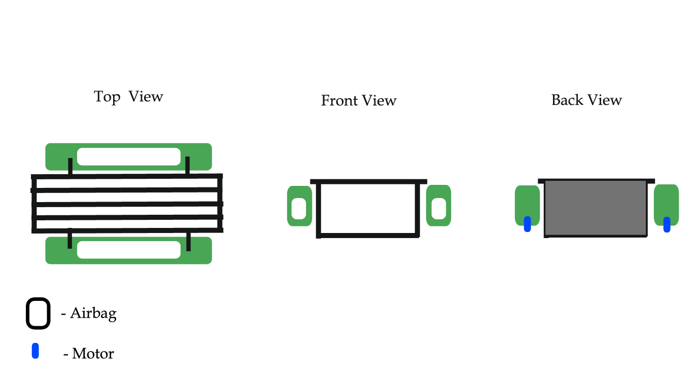

# Maker Movement

Maker movement reignites the artisan spirit. It gathers people from all communities and careers with different skill levels into creating something on their own. Students that participate in the maker movement begin to believe that they are capable of solving any problems. Students learn to trust themselves and in their capabilities to solve any complications.

Making and redesigning functional electronics is a separate segment of the Maker Movement. From completing electronic projects that come in kits to building unique electronic equipment from components, technologically savvy makers can bring their programming and electronic skills to use in a productive and effective way.

There are critical components to educating young people to become innovators. This unique problem-solving approach will add value and excitement to the hands-on projects created by the makers. The projects' outcomes will contribute to the solution of a real-world problem and will also be personally rewarding. The essence of developing those ideas will train students to enhance their critical thinking. The Maker movement incorporates teamwork and team building which allows students to learn and inspire at the same time.

## AquaMagic (Water Garbage Collector )

Water is essential to life, yet water pollution is one of the most serious environmental threats that we face today. Our lakes and rivers are increasingly getting polluted. Reversing the effect of water pollution is very difficult and can take years to remove all the harmful substances from the water.

The main aim of this water garbage collector project is to clean the waste that gets accumulated on the surface of water bodies thus keeping the water clean hence decreasing pollution.

## Automatic Hand Sanitizer

The Automatic hand Sanitizer is an infrared motion sensor-based dispenser. It’s used to dispense any alcohol-based sanitizer. It has a touch-less operation, which makes people fearless and more confident about the sanitization process. It is also known as a touch-less or contact-less sanitizer dispenser.

## Automatic Snare Drum

This is an automated snare drumming robot that consists of two drumsticks that are controlled by an Arduino, and all of the chords will be written directly into the Arduino's software. The automated snare drum is able to keep a steady beat with precision and ease, the users are able to slow down and speed up any drumbeat.

## Hand Gesture Control

The principle behind the Arduino-based Hand Gesture Control of Computers is actually very simple. All you have to do is use two Ultrasonic Sensors with Arduino, place your hand in front of the Ultrasonic Sensor and calculate the distance between the hand and the sensor. Using this information, relevant actions in the computer can be performed.

The position of the Ultrasonic Sensors is very important. Place the two Ultrasonic Sensors on the top of a laptop screen at either end. The distance information from Arduino is collected by a Python Program and a special library called PyAutoGUI will convert the data into keyboard click actions.

