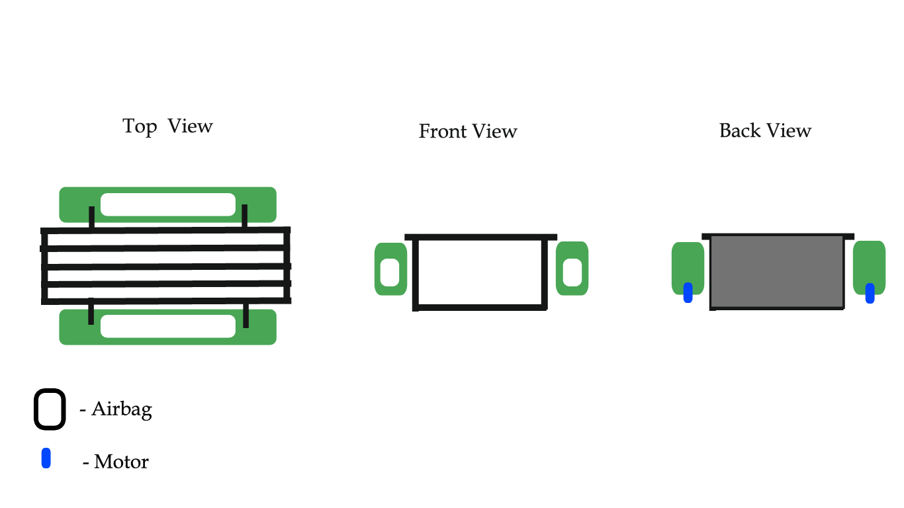
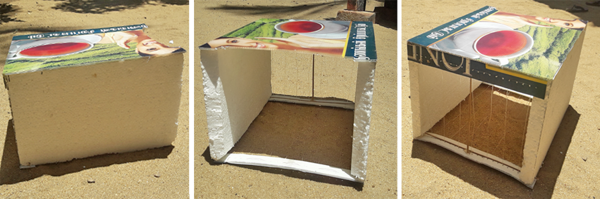

# AquaMagic (Water Garbage Collector )

## Background
Water pollution is caused in many ways. For example, water pollution is caused by garbage, oil spills, global warming, etc. But today I am going to state about water pollution from garbage. People pollute the water from garbage that is produced in industrial, agricultural farming, sewage etc. We pollute the water without knowing, for example, we pollute the water for cleaning, heating, making food and for other things. By polluted water in poor countries cause around 80% of the population in illness.  
The history started around the 1800s when people did not know what was good or bad for them or the environment, so throwing waste, garbage in to water bodies was like a freedom for people in the old times. Around the mid 19th century, people started to ingest chemicals that they thought it was good for them, but now those chemicals are considered being the most dangerous chemicals. Around the WW2 factories and industrials were constructed. Fertilizers and other chemicals were in progress, which severely polluted the water. Finally around the 1969 the government had realized that they took the wrong decision by letting the town throw garbage freely into the water bodies. Around the 21th century, throwing garbage in river lakes and other water bodies is still an issue, because people are not aware of what they are drinking and why is it dangerous.

## Author
Viththiyakaran Nadarajah [Click to see](http://team.dreamspace.academy/viththi)

##  Acknowledgment
 - Aravith Panch , Co-founder and Director of Innovation, DreamSpace Academy , Batticaloa , Sri Lanka.
 - Kishoh Navaretnarjah , Co-founder and Director, DreamSpace Academy , Batticaloa , Sri Lanka.
 - Thanuskar Srikaran , In charge of Maker Education , DreamSpace Academy , Batticaloa , Sri Lanka.

## Design

## Model

