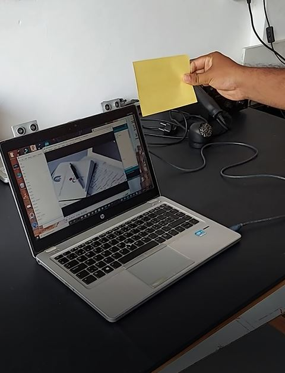

# Automatic Hand Gesture control

Recently hand gesture controls are getting very famous. This technique is called Leap motion which enables us to control certain functions on our computer/Laptop by simply waving our hand in front of it. It is very cool and fun to do it, but these laptops are really priced very high. So in this project let us try building our own Gesture control Laptop/Computer by combining the Power of Arduino and Python.

 

 

### Author

Jerushan Sritharn  [Click to see](https://dreamspace.academy/pages/3-2-5-dreambot.php)

### Acknowledgment

 - Aravith Panch , Co-founder and Director of Innovation, DreamSpace Academy , Batticaloa , Sri Lanka.
 - Kishoh Navaretnarjah , Co-founder and Director, DreamSpace Academy

### Components Needed
 1. Arduino uno
 2. Ultrasonic Sensor HC-SR04
 3. Jumper Cables
 4. Breadboard

We will use two Ultrasonic sensors to determine the position of our hand and control a media player (VLC) based on the position. I have used this for demonstration, but once you have understood the project, you can do anything by just changing a few lines of code and control your favorite application in your favorite way.

The concept behind the project is very simple. We will place two Ultrasonic (US) sensors on top of our monitor and will read the distance between the monitor and our hand using Arduino, based on this value of distance we will perform certain actions. To perform actions on our computer we use Python pyautogui library. The commands from Arduino are sent to the computer through serial port (USB). This data will be then read by python which is running on the computer and based on the read data an action will be performed.

Circuit Diagram :

