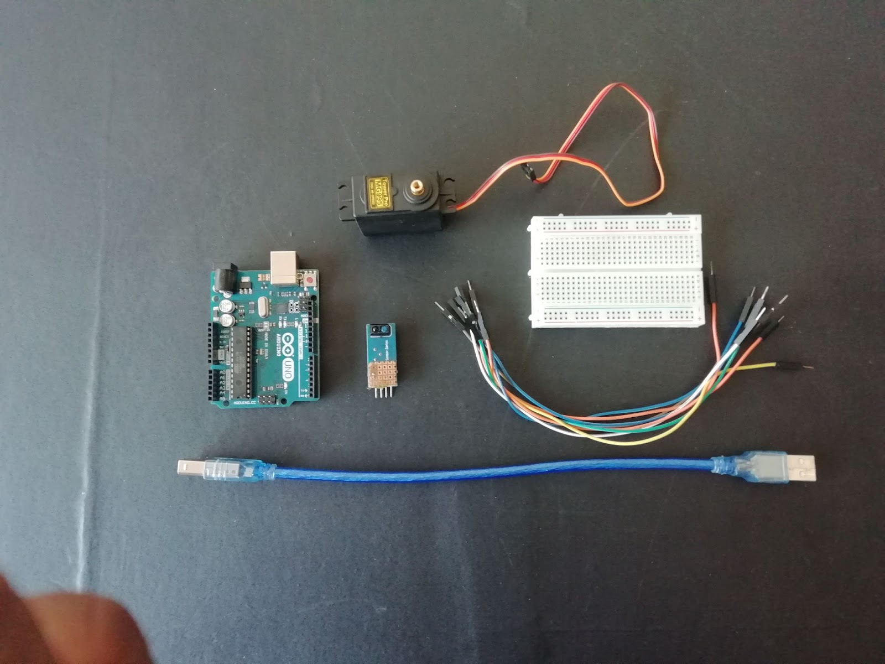
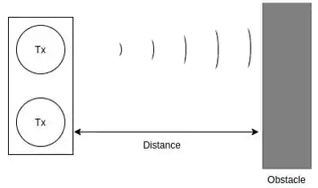
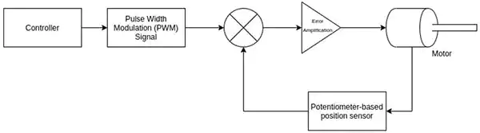
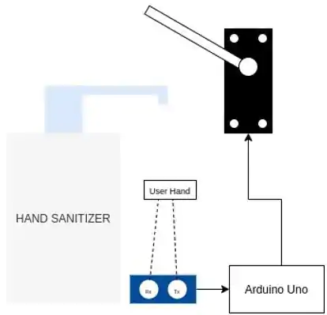

# Automatic Hand Sanitizer Dispenser

The **COVID-19** pandemic has radically affected life for almost everyone around the globe, and makers are no exception. With everyone being more careful of their interactions with humans and objects, personal hygiene has taken serious precedence over all other factors in public space. A lot of public places have hand sanitizers for visitors, but they need to be manually pressed.

To avoid any contact at all, some no-touch hand sanitizer dispensers are commercially available, but they are expensive and most off-the-shelf commercial sanitizers cannot be automated. In this project, we create a contactless hand sanitizer dispenser that can be used for any press-to-release hand sanitizer available in the market. We’ll cover the basics of how these sensors work before detailing how to make one of these on your own!

### Material List

1. Arduino UNO
2. Ultrasonic Sensor HC-SR04
3. Serco Motor
4. Breadboard
5. Jumper Cables
6. 9V Battery

### What is an Ultrasonic Sensor?

An ultrasonic sensor measures the distance between its transmitter and an obstacle in front using ultrasonic sound waves (operational at 40 KHz) beyond the human audible sound wave range. The transmitter element sends out the ultrasonic wave which is reflected from the target and is picked up by the receiver module. Using the time-of-flight principle and the known speed of sound (~340 m/s), the distance between the sensor and the target is calculated.

### Servo Motor

Let’s get into some more technical bits for a moment: a servo motor is the most common position-controlled actuator. It works on the conventional servo-mechanism principle, where a rotary potentiometer measures the position of the shaft based on the varying resistance and feeds it to a comparator. The comparator computes the difference between the reference position value from the controller against the actual position and sends the amplified error signal to the motor.

Automatic Dispenser
The working principle of the automatic sanitizer dispenser is to actuate the servo to press the sanitizer tap whenever the sensor observes a low distance reading due to an obstruction in its line-of-sight. When a person’s hand comes below the sanitizer and obstructs the sensor line-of-sight, the Arduino board receives a low distance reading and instructs the servo motor to actuate and dispense the sanitizer.

### Automatic Dispenser

The working principle of the automatic sanitizer dispenser is to actuate the servo to press the sanitizer tap whenever the sensor observes a low distance reading due to an obstruction in its line-of-sight. When a person’s hand comes below the sanitizer and obstructs the sensor line-of-sight, the Arduino board receives a low distance reading and instructs the servo motor to actuate and dispense the sanitizer.

