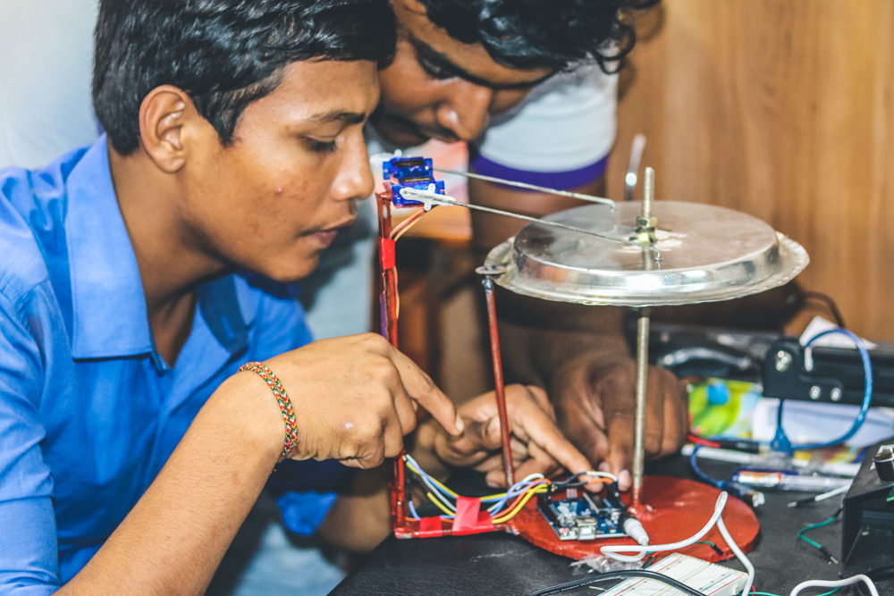

# Automatic Snare Drum

Anushan from Bt/Shivnanada Vidyalaya is an advanced level student, who is a very passionate young innovator. He planned to do an automatic snare for an upcoming innovation competition. But he could not have enough knowledge in programming even though all the mechanical parts are done.

Therefore with an advice from teacher he came to know that programming is also equally important. So he started to search for support and finally he came to know about Dreamspace Academy and there works in basic electronics and maker education fields. And reached the  Dreamspace Academy director seeking help. After knowing the issues the director held a meeting between Makerspace team and him. In that meeting Mr. Thanushkar  SriKanran and Mr.Viththiyakaran and Makerspace co-team got a clear vision of  his project and the issues faced by him.

The day after discussion with the makerspace team in charge Mr.Thanshkar and Mr.Viththiyakaran set another private meeting then came up with a solution to make and Arduino automatic snare.

## Collaborators
* S.Anushan
* S.Thanushkar
* N.Viththiyakaran

## Materials

* Arduino 01
* Servo Motor 02
* Jumper Wires
* 9V Power supply
* Sticks 2
* Snare 01

## Product

